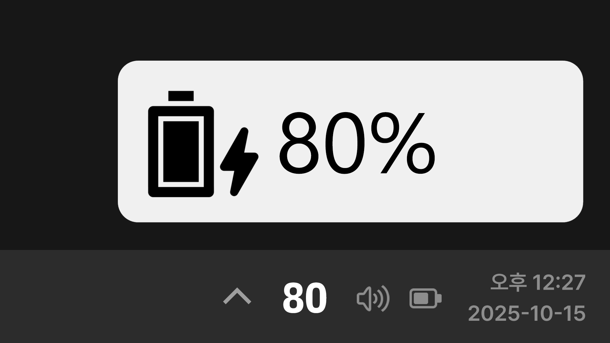

<picture>
  <source media="(prefers-color-scheme: dark)" srcset="https://github.com/user-attachments/assets/f5855e80-f63f-4460-83d8-fa41d451916b">
  <source media="(prefers-color-scheme: light)" srcset="https://github.com/user-attachments/assets/9a7707da-d0c1-48ba-a372-36d2c66351dd">
  
</picture>

# Battify

### 쌔끈한 팝업과 트레이 아이콘으로 알려주는 배터리 알림 프로그램

[English](README.md) | [한국어](README.ko.md) | [日本語](README.ja.md) | [简体中文](README.zh-CN.md) | [Deutsch](README.de.md)

---

## 다운로드

### Microsoft Store (권장)

### 포터블 버전

[릴리즈 페이지](https://github.com/pdjdev/Battify/releases)를 참고하세요.

## 주요 기능

- 작업 표시줄에서 확인할 수 있는 배터리 퍼센트 아이콘
- 충전 상태가 변경될 때 알림 팝업 표시
- Windows 10 및 11의 라이트·다크 테마에 맞춘 스타일
- HiDPI 지원

## 요구 사양

- Windows 10 이상
- Windows 10 및 11에 포함된 .NET Framework 4.8

## 스크린샷

## 다국어 지원

Battify는 영어, 한국어, 일본어, 중국어 간체, 독일어를 지원합니다. Windows 표시 언어에 맞는 언어를 자동으로 선택하며, 번역이 없는 경우 영어를 사용합니다.

## 라이선스

Made by PBJSoftware (박동준)

Battify는 MIT License로 배포됩니다.
